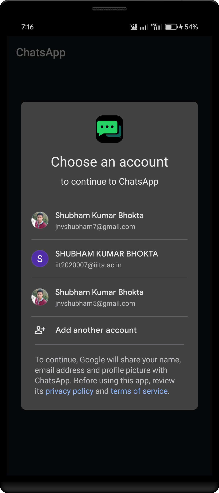
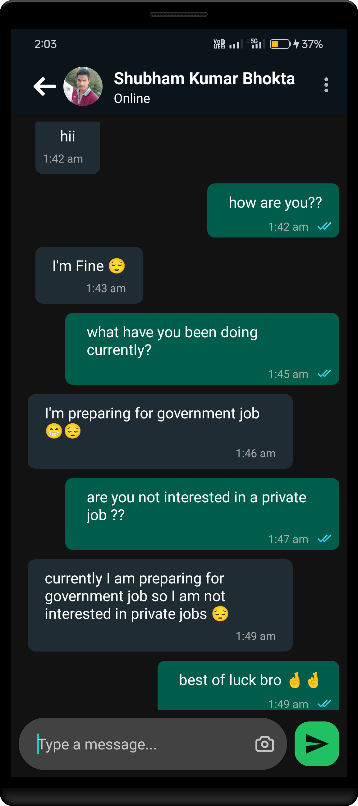

# ChatsApp

ChatsApp is a messaging Android application that allows users to connect, share stories, send photos, engage in group chats, and express themselves with emojis. The app is currently available on the Mi App Store and has gained popularity with over 105+ users.

<h2 align="center">
  <a href="https://global.app.mi.com/details?lo=IN&la=en_US&id=com.example.chatsapp" style="display: inline-block;">Deploy Link - ChatsApp</a>

</h2>


## Screenshots

<p float="left">
<p float="left">
  
  
   
  
  
  
  
  
  
  
  
  
  
  
  
  
 
</p>

## Features

- Free messaging
- Story sharing
- Photo sending
- Group chatting
- Emoji reactions

## Technology Stack

- Java
- Android
- Firebase
- Android Studio

## Installation

To run the ChatsApp project locally, follow these steps:

1. Clone the repository to your local machine.

   ```bash
   git clone https://github.com/jnvshubham7/ChatsApp.git
   ```
2. Open the project in Android Studio.
3. Build and run the app on an Android emulator or a physical device.

   ```bash
   cd ChatsApp
   ```

   Open the project in Android Studio and build the app using the IDE's build and run commands.

Now you should be able to explore and test the ChatsApp on your local development environment.

